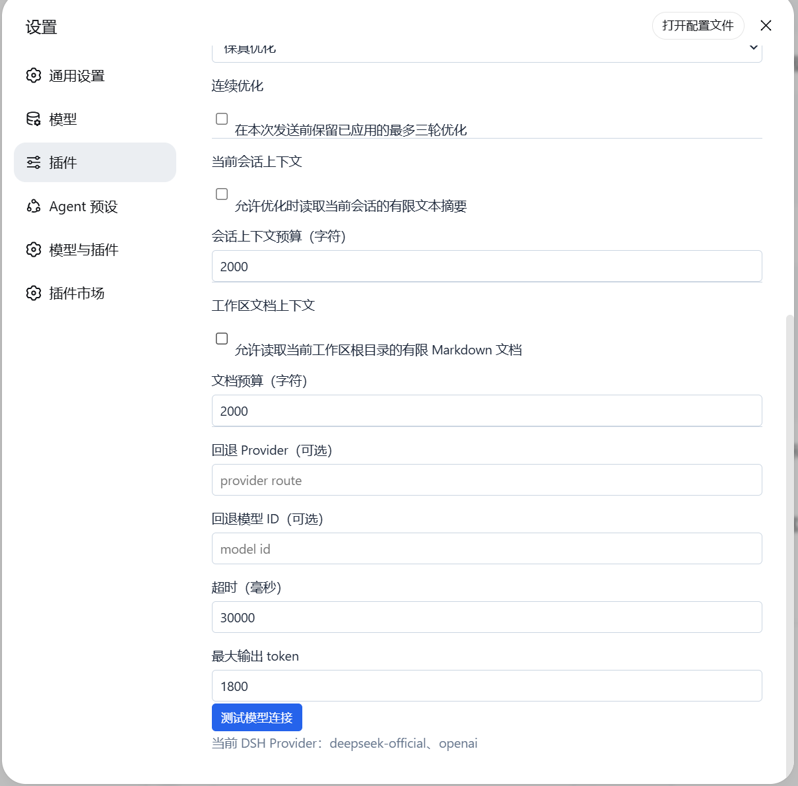
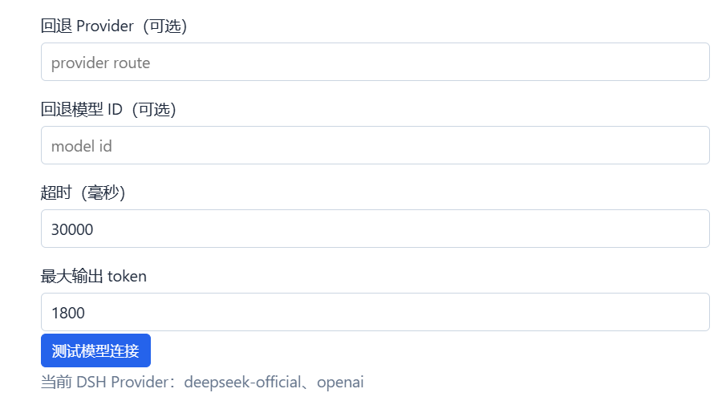

# AI Input Enhancer

[中文](README.md) | [English](README.en.md)

[](https://github.com/zhengzeyong9527-droid/ai-input-enhancer/releases/latest)
[](LICENSE)
[](https://github.com/awesome-dsh-plugin/awesome-dsh-plugin#ui-enhancements)

A prompt optimizer for DeepSeek Harness (DSH). It adds a prompt-optimization action to the composer, writes successful results directly into the draft, and lets you undo back to the original prompt.

## Features

- Explicit faithful, developer, and specification modes.
- Visible loading state with cancellation while optimizing.
- Direct draft replacement with one-click undo to the original prompt.
- Optional session-local memory of the three most recently applied optimizations.
- Optional budgeted current-conversation context.
- Optional budgeted Markdown context from the current session workspace root.
- Primary and fallback model routes, timeout, and output-token controls.
- No API keys are stored by the plugin.

## Interface

**Composer action**


**Advanced settings**

Advanced settings are grouped into optimization strategy, conversation context, workspace document context, and model limits so long explanations and inputs stay readable.



**Model and execution limits**



## Modes

- **Faithful** improves clarity without inventing requirements, facts, architecture, or scope.
- **Developer** structures user-provided engineering facts without selecting a stack or design.
- **Specification** may add needed defaults, but labels them under `## Default assumptions` for review.

## Privacy and Context

The draft is sent to the DSH model route chosen by the user. Extra context is disabled by default.

Conversation context reads only current `user/message` and `assistant/message` text. Workspace context reads at most three relevant Markdown files directly inside the current session workspace root. Both sources are independently budgeted and gracefully degrade when unavailable. Full drafts, session history, and document contents are not persisted.

## Installation

```powershell
dsh plugin --profile web add zzy-dsh-prompt-optimizer
```

Restart the existing DSH Web process and refresh its current URL.

## Evaluation`n`nThe reproducible 30-case blinded A/B protocol, sanitized inputs, and independent evaluation are available in [tests/evaluation/report.md](tests/evaluation/report.md) and [tests/evaluation/conclusion.md](tests/evaluation/conclusion.md).`n`n## License

MIT
